# Entity Relationship Diagram — AuditWise Core Models

> Mermaid ERD showing core domain entities and their relationships.

```mermaid
erDiagram
    Firm ||--o{ User : "employs"
    Firm ||--o{ Client : "manages"
    Firm ||--o{ Subscription : "has"
    
    Client ||--o{ Engagement : "subject of"
    
    Engagement ||--o{ PhaseProgress : "tracks"
    Engagement ||--o{ EngagementTeam : "staffed by"
    Engagement ||--o{ RiskAssessment : "assessed for"
    Engagement ||--o{ MaterialityAssessment : "materiality"
    Engagement ||--o{ InternalControl : "controls"
    Engagement ||--o{ ControlTest : "tested"
    Engagement ||--o{ SubstantiveTest : "procedures"
    Engagement ||--o{ SectionSignOff : "signed off"
    Engagement ||--o{ ReviewNote : "reviewed"
    Engagement ||--o{ Document : "documented"
    Engagement ||--o{ AuditTrail : "logged"
    Engagement ||--o{ Observation : "findings"
    
    Engagement ||--o{ TBBatch : "trial balance"
    Engagement ||--o{ GLBatch : "general ledger"
    Engagement ||--o{ ImportBatch : "imports"
    Engagement ||--o{ ChartOfAccount : "COA"
    
    TBBatch ||--o{ TrialBalance : "rows"
    GLBatch ||--o{ GeneralLedger : "entries"
    ImportBatch ||--o{ ImportAccountBalance : "balances"
    ImportBatch ||--o{ ImportJournalLine : "journals"
    
    ChartOfAccount ||--o{ MappingAllocation : "mapped to"
    MappingAllocation }o--|| FSHead : "FS line"
    
    FSHead ||--o{ FSHeadWorkingPaper : "working papers"
    FSHead ||--o{ FSHeadAdjustment : "adjustments"
    FSHead ||--o{ FSSnapshot : "snapshots"
    
    Engagement ||--o{ EQCRAssignment : "quality review"
    EQCRAssignment ||--o{ EQCRComment : "comments"
    EQCRAssignment ||--o{ EQCRChecklistItem : "checklist"
    
    Engagement ||--o{ ChecklistItem : "checklists"
    Engagement ||--o{ Deliverable : "deliverables"
    Engagement ||--o{ Attachment : "attachments"
    
    Engagement ||--o{ GoingConcernAssessment : "going concern"
    Engagement ||--o{ SubsequentEvent : "subsequent events"
    Engagement ||--o{ WrittenRepresentation : "representations"
    Engagement ||--o{ AuditReport : "report"
    Engagement ||--o{ ManagementLetter : "mgmt letter"
    Engagement ||--o{ CompletionMemo : "completion"
    
    Engagement ||--o{ SamplingRun : "sampling"
    Engagement ||--o{ UpstreamImpact : "impacts"
    
    User ||--o{ EngagementTeam : "member of"
    User ||--o{ SectionSignOff : "signs"
    User ||--o{ AIUsageLog : "uses AI"
    User ||--o{ AIInteractionLog : "AI interactions"
    
    Firm ||--o{ ISQMGovernance : "quality mgmt"
    Firm ||--o{ FirmWideControl : "controls"
    Firm ||--o{ AISettings : "AI config"
    
    Engagement ||--o{ ComplianceChecklist : "compliance"
```

## Model Groups

### Core Entities
- **Firm** — Multi-tenant organization (top-level isolation boundary)
- **User** — System users with role-based access
- **Client** — Audit client entity
- **Engagement** — Central audit engagement with 9-phase lifecycle

### Audit Workflow
- **PhaseProgress** — Tracks completion per audit phase
- **ChecklistItem** — Phase-specific checklist items
- **SectionSignOff** — Sign-off records (Prepared/Reviewed/Approved)
- **ReviewNote** — Review comments and feedback

### Financial Data
- **TBBatch/TrialBalance** — Trial balance import and line items
- **GLBatch/GeneralLedger** — General ledger transactions
- **ChartOfAccount** — Chart of accounts
- **FSHead** — Financial statement line items
- **MappingAllocation** — GL-to-FS mapping

### Risk & Controls
- **RiskAssessment** — Identified risks with inherent/residual scoring
- **InternalControl** — Entity controls
- **ControlTest** — Tests of controls
- **SubstantiveTest** — Substantive procedures

### Quality Management
- **EQCRAssignment** — Engagement quality control reviews
- **ISQMGovernance** — Firm-wide quality management
- **FirmWideControl** — ISQM-1 controls

### AI Layer
- **AIUsageLog** — AI output tracking with edit/approval status
- **AIInteractionLog** — Detailed AI interaction records
- **AISettings** — Firm and platform AI configuration

### Compliance
- **ComplianceChecklist** — Regulatory checklists (Companies Act, FBR, SECP)
- **Observation** — Audit findings (ISA 450)
- **UpstreamImpact** — Impact tracking for data changes
