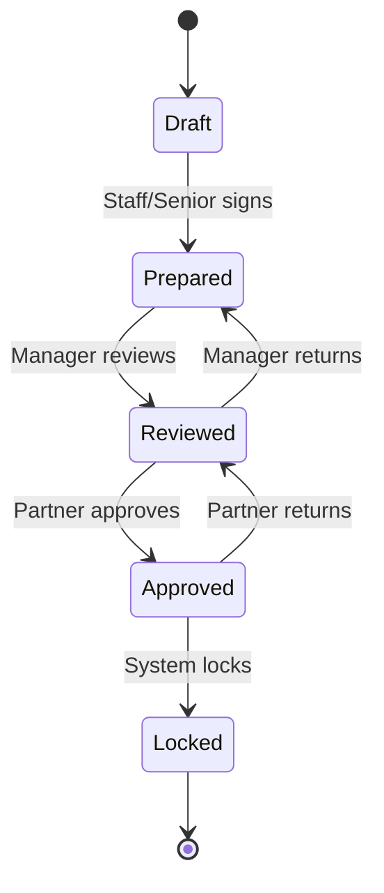

# Engagement Workflow Flowchart — AuditWise

> Mermaid state diagram showing the 9-phase audit engagement lifecycle.

```mermaid
stateDiagram-v2
    [*] --> ONBOARDING: Create Engagement

    ONBOARDING --> PRE_PLANNING: Gate: Team assigned,\nEngagement letter signed
    
    PRE_PLANNING --> REQUISITION: Gate: Acceptance decision,\nIndependence declared,\nRisk assessment (initial)
    
    REQUISITION --> PLANNING: Gate: Information requests sent,\nTrial Balance uploaded,\nGL imported
    
    PLANNING --> EXECUTION: Gate: Materiality approved,\nRisk assessment finalized,\nAudit strategy determined,\nSampling plan set
    
    EXECUTION --> FINALIZATION: Gate: All procedures completed,\nEvidence sufficient,\nControl tests done,\nSubstantive tests done
    
    FINALIZATION --> REPORTING: Gate: Going concern assessed,\nSubsequent events reviewed,\nRepresentations obtained,\nManager review complete
    
    REPORTING --> EQCR: Gate: Audit report drafted,\nManagement letter prepared,\nPartner review complete
    
    EQCR --> INSPECTION: Gate: EQCR assignment completed,\nAll comments resolved,\nEQCR sign-off obtained
    
    INSPECTION --> [*]: Gate: Inspection checklist complete,\nFile assembly verified

    state ONBOARDING {
        [*] --> ClientSetup
        ClientSetup --> TeamAssignment
        TeamAssignment --> EngagementLetter
    }

    state PRE_PLANNING {
        [*] --> AcceptanceContinuance
        AcceptanceContinuance --> IndependenceDeclaration
        IndependenceDeclaration --> EthicsConfirmation
        EthicsConfirmation --> InitialRiskAssessment
    }

    state PLANNING {
        [*] --> MaterialityDetermination
        MaterialityDetermination --> RiskAssessment
        RiskAssessment --> AuditStrategy
        AuditStrategy --> AuditProgram
        AuditProgram --> SamplingPlan
    }

    state EXECUTION {
        [*] --> ControlTesting
        ControlTesting --> SubstantiveTesting
        SubstantiveTesting --> AnalyticalProcedures
        AnalyticalProcedures --> EvidenceCollection
    }

    state FINALIZATION {
        [*] --> GoingConcern
        GoingConcern --> SubsequentEvents
        SubsequentEvents --> Misstatements
        Misstatements --> WrittenRepresentations
        WrittenRepresentations --> CompletionMemo
    }
```

## Phase Gate Controls

| Gate | From → To | Prerequisites | Enforcement |
|---|---|---|---|
| G1 | Onboarding → Pre-Planning | Team assigned, engagement letter | enforcementEngine.ts |
| G2 | Pre-Planning → Requisition | Acceptance decision, independence | enforcementEngine.ts |
| G3 | Requisition → Planning | TB uploaded, GL imported | enforcementEngine.ts |
| G4 | Planning → Execution | Materiality approved, risk finalized | enforcementEngine.ts |
| G5 | Execution → Finalization | Procedures complete, evidence sufficient | enforcementEngine.ts |
| G6 | Finalization → Reporting | Going concern, subsequent events, manager review | enforcementEngine.ts |
| G7 | Reporting → EQCR | Report drafted, partner review | enforcementEngine.ts |
| G8 | EQCR → Inspection | EQCR complete, comments resolved | enforcementEngine.ts |
| G9 | Inspection → Archive | File assembly verified | enforcementEngine.ts |

## Sign-Off Flow

## Override Controls
- Partner can override gate blocks with documented reason
- Override is logged in immutable audit trail
- Post-approval edits trigger version bump + re-review requirement
